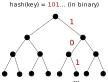
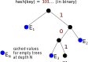
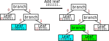
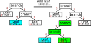
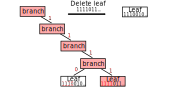
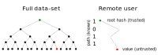
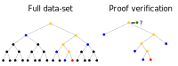
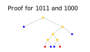
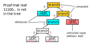
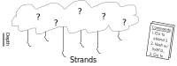

## Introduction

Quadrable is an authenticated multi-version embedded database. It is implemented as a sparse binary merkle tree with compact partial-tree proofs.

* *Authenticated*: The state of the database can be digested down to a 32-byte value, known as the "root". This represents the complete contents of the database, and any modifications to the database will generate a new root. Anyone who knows a root value can perform remote queries on the database and be confident that the responses are authentic. To accomplish this, the remote server provides "proofs" along with the responses, which are validated against the root.
* *Multi-version*: Many different versions of the database can exist at the same time. Deriving one version from another doesn't require copying the database. Instead, all of the data that is common between the versions is shared. This "copy-on-write" behaviour allows very inexpensive database snapshots or checkpoints, so these can be used liberally and for many purposes.
* *Embedded*: Quadrable's main functionality is in a C++ header-only library that is intended to be used by applications such as the `quadb` command-line tool. For persistent storage, it uses [LMDB](https://symas.com/lmdb/), an efficient database library that embeds the backing storage into your process by memory-mapping a file.

Although not required to use the library, it may help to understand the core data-structure used by Quadrable:

* *Merkle tree*: Each version of the database is represented by a tree. The leaves of this tree are the inserted records, and they are combined together with a cryptographic hash function to create a level of intermediate nodes. These intermediate nodes are then combined in a similar way to create a smaller set of intermediate nodes, and this procedure continues until a single node is left, which is the root. These "hash trees" are commonly called merkle trees, and they provide the mechanism for Quadrable's authentication. See my presentation on merkle trees for a detailed overview FIXME: link.
* *Binary*: The style of merkle tree used by Quadrable combines together exactly two nodes to create a node in the next layer. There are alternative designs such as N-ary radix trees, AVL trees, and tries, but they are more complicated to implement and typically have a higher authentication overhead (in terms of proof size). With a few optimisations and an attention to implementation detail, binary merkle trees enjoy almost all the benefits of these more complicated designs, as described in FIXME.
* *Sparse*: A traditional binary merkle tree does not have a concept of an "empty" leaf. This means that the leaves must be in a sequence, say 1 through N (with no gaps). This raises the question about what to do when N is not a power of two. Furthermore, adding new records in a "path-independent" way, where insertion order doesn't matter, is difficult to do efficiently. Quadrable uses a sparse merkle tree structure, where there *is* a concept of an empty leaf, and leaf nodes can be placed anywhere inside a large (256-bit) leaf location. This means that hashes of the database keys can correspond directly to each leaf's location in the tree.

Values are authenticated by generating and importing proofs:

* *Compact proofs*: In the classic description of a merkle tree, a value is proved to exist in the tree by providing a list of hashes as a proof. The value is hashed and then combined with this list in order to reconstruct the hashes of the intermediate nodes. If at the end of the list you end up with the root hash, the value is considered authenticated. However, if you wish to authenticate multiple values in the tree at the same time then these linear proofs can have a lot of space overhead due to duplicated hashes. Also, some hashes that would need to be included with a proof for a single value can instead be calculated by the verifier. Quadrable's compact proof encoding never transmits redundant sibling hashes, or ones that could be calculated during verification. It does this with a low overhead (approximately 0-4 bytes per proved item).
* *Partial-trees*: Since the process of verifying a merkle proof reconstructs some intermediate nodes of the tree, Quadrable constructs a partial-tree when authenticating a set of values. This partial-tree can be queried in the same way as if you had the full tree locally, although it will throw errors if you try to access non-authenticated values. You can also make modifications on a partial-tree, so long as you don't modify a non-authenticated value. The new root of the partial-tree will be the same as the root would be if you had made the same modifications on the full tree. After importing a proof, additional proofs exported from the same tree can be merged, expanding a partial-tree over time as new proofs are received. New compact proofs can also be generated *from* a partial-tree, as long as the values to prove are authenticated in the partial-tree.

## Building

### Dependencies

The LMDB library and header files are required. On Ubuntu/Debian run this:

    sudo apt install -y liblmdb-dev

### Compilation

Clone the repo, `cd` into it, and run these commands:

    git submodule update --init
    make -j

### Tests

You can run the tests like so:

    make test

You can view a coverage report by running:

    make coverage

You will need `lcov` installed. The report will be in this file: `quadrable/coverage-report/index.html`

## Command-line

The `quadb` command can be used to interact with a Quadrable database. It is very roughly modeled after `git`, so it requires sub-commands to activate its various functions. You can run `quadb` with no arguments to see a short help summary and a list of the available sub-commands.

### quadb init

Before you can use other commands, you must initialise a directory to contain the Quadrable database. By default it inits `./quadb-dir/`:

    $ quadb init
    Quadrable directory init'ed: ./quadb-dir/

You can specify an alternate directory with the `--db` flag:

    $ quadb --db=$HOME/.quadrable init
    Quadrable directory init'ed: /home/doug/.quadrable/

Or the `QUADB_DIR` environment variable:

    $ QUADB_DIR=/path/to/quadrable quadb init
    Quadrable directory init'ed: /path/to/quadrable

### quadb status

The status command shows you some basic information about your current database tree:

    $ quadb init
    Head: master
    Root: 0x0000000000000000000000000000000000000000000000000000000000000000 (0)

*Head* is like your current branch in git, and can be thought of as a symbolic link that is updated to point to the latest version of the tree as it is modified. The default head is `master`. Quadrable doesn't call these links "branches" because it has a concept of branches internally, and this would confuse the code too much.

*Root* is the hash of the root node in your database. Provided the hash function is cryptographically secure, this is a globally unique identifier for the current state of the tree pointed to by your head. For an empty tree, a special all-zero value is used (see FIXME).

The number in parentheses after the root hash is the *nodeId*. This is an internal value used by Quadrable and is shown here for informational purposes only (see FIXME).

### quadb put

This adds a new record to the database, or updates an existing one. On success there is no output:

    $ quadb put key val

Unless the value was the same as a previously existing one, the current head will be updated to have a new root, and a new nodeId will be allocated for it:

    $ quadb status
    Head: master
    Root: 0x0b84df4f4677733fe0956d3e4853868f54a64d0f86ecfcb3712c18e29bd8249c (1)

### quadb get

This is the complement to `put`, and is used to retrieve previously set values:

    $ quadb get key
    val

An error will be thrown if you try to get a key that is not present in the tree:

    $ quadb get no-such-key
    quadb error: key not found in db

### quadb del

This deletes a key from the database. If there was no such key in the database, it does nothing. On success there is no output:

    $ quadb del key

If we run `status` again, we can see the root has changed back to the all-zeros value, signifying an empty tree:

    $ quadb status
    Head: master
    Root: 0x0000000000000000000000000000000000000000000000000000000000000000 (0)

This is an important property of Quadrable: Identical trees have identical roots. "Path dependencies" such as the order in which records were inserted, or whether any deletions or modifications occurred along the way, do not affect the resulting roots.

### quadb import

If you wish to insert multiple records into the DB, running `quadb put` multiple times is inefficient. This is because each time it is run it will need to create new intermediate nodes and discard the previously created ones.

A better way to do it is to use `quadb import` which can put multiple records with a single traversal of the tree. This command reads comma-separated `key,value` pairs from standard input, one per line. The separator can be changed with the `--sep` option. On success there is no output:

    $ perl -E 'for $i (1..1000) { say "key $i,value $i" }' | quadb import

### quadb export

This is the complement to `quadb import`. It dumps the contents of the database as a comma-separated (again, customisable with `--sep`) list of lines:

    $ quadb export
    key 915,value 915
    key 116,value 116
    key 134,value 134
    key 957,value 957
    key 459,value 459
    ...

Note that the output is *not* sorted by the key. It is sorted by the hash of the key, because that is the way records are stored in the tree (FIXME see section on adversarial). You can pipe this output to the `sort` command if you would like it sorted by key.

### quadb head

A database can have many heads. You can view the list of heads with `quadb head`:

    $ quadb head
    => master : 0x0000000000000000000000000000000000000000000000000000000000000000 (0)

The `=>` arrow indicates that `master` is the current head. The heads are sorted by `nodeId` (the number in parentheses), so the most recently updated heads will appear at the top (except for empty trees, which always have a nodeId of 0).

`head rm` deletes a head (or does nothing if the head doesn't exist):

    $ quadb head rm headToRemove

### quadb checkout

The `checkout` command can be used to change the current head. If we switch to a brand-new head, then this head will start out as the empty tree. For example, let's switch to a brand-new head called `temp`. On success there is no output:

    $ quadb checkout temp

This new head will not appear in the `quadb head` list until we have completed a write operation, like so:

    $ quadb put tempKey tempVal
    $ quadb head
    => temp : 0xf4f60482d2e639d24d6dfae605337968a86c404f5c41286987a916e40af21261 (2427)
       master : 0x0000000000000000000000000000000000000000000000000000000000000000 (0)

The `tempKey` record that we just inserted only exists in the `temp` head, and if we checkout back to master it would not be visible there.

Running `quadb checkout` with no head name will result in a detached head pointing to an empty tree (see FIXME).

### quadb fork

When we created a new head with checkout, it was initialised to an empty tree. Instead, we may choose to use `quadb fork` to copy the current head to the new head:

    $ quadb fork temp2
    $ ./quadb head
       temp : 0xf4f60482d2e639d24d6dfae605337968a86c404f5c41286987a916e40af21261 (2427)
    => temp2 : 0xf4f60482d2e639d24d6dfae605337968a86c404f5c41286987a916e40af21261 (2427)
       master : 0x0000000000000000000000000000000000000000000000000000000000000000 (0)

Our new `temp2` head starts off with the same root as `temp`. We can now modify `temp2` and it will not affect the `temp` tree.

Although semantically `quadb fork` acts like it copies the tree pointed to by the current head, no copying actually occurs. In fact, the two trees share the same structure so forking is a very inexpensive operation. Cheap database snapshots is an important feature of Quadrable, and is useful for a variety of tasks.

`quadb fork` can take a second argument which represents the head to be copied from, instead of using the current head. Or it can take no arguments, in which case the current head is forked to a detached head (see FIXME).

### quadb diff

You can view the differences between the head you have checked out and another branch with `quadb diff`. If the heads are equivalent, there will be no output:

    $ quadb diff temp
    $

Let's add a new key, delete an existing one from our current branch, and run `diff` again:

    $ quadb put new test
    $ quadb del tempKey
    $ quadb diff temp
    -tempKey,tempVal
    +new,test

Now the diff shows one line per modification. If the modification was an insertion or update, the the first character will be `+` and the key/value will be the new record to be set. If it was a deletion, the first character will be `-` and the key/value will be the old record that has been removed.

* You can change the separator using the `--sep` option, just as with `import`/`export`.
* If two trees have been forked from one another recently, then diffs will be very fast. This is because the algorithm will detect shared portions of the tree and not bother diffing them. Diffing two trees that don't share structure (for example, if they were separately `import`ed from the same data) will still work, but will run slower. In the future we may implement a `dedup` command that uses `diff` to detect equal but unshared structure and make them shared.

### quadb patch

This command accepts a diff on standard input, and applies it to the current head.

* The format is the same as printed by `diff`
* Lines that start with `#` are treated as comments and are ignored
* The separator argument `--sep` must match what was used in the `diff` invocation

### quadb exportProof

FIXME

### quadb importProof

FIXME

### quadb mergeProof

FIXME

## Tree Structure

### Trees and Exponential Growth

The reason we use trees is because of the exponential growth in the number of nodes as the depth is increased. The number of nodes that must be traversed to get to a leaf is related to the number of levels of the tree, which grows much slower than the number of nodes.

In computer science trees are usually drawn as growing in the downwards direction, for some reason. Because of this, we'll use the term "depth" to refer to how many levels down you are from the top node (the "root").

### Merkle Trees

In a merkle tree, each node has a "nodeHash" which is the formed by hashing the concatenation of its children nodeHashes. In Quadrable the tree is binary, so there are always exactly two children (except for leaf nodes, which have none). The order of the concatenation is important: The left child's nodeHash comes first, followed by the right child's:

The advantage of a merkle tree is that the nodeHash of the node at depth 0 (the top level) is a digest of all the other nodes and leaves. This top-level nodeHash is often just called the "root". As long as the tree structure is carefully designed, and the hash function is secure, any changes to the tree or its contents will result in a new, distinct root.

### Keys

In Quadrable's implementation of a merkle tree, keys are first hashed and then the bits these hashes are used to traverse the tree to find the locations where the values are stored. A `0` bit means to use the left child of a node, and a `1` bit means use the right child:

Keys are hashed for multiple reasons:

* It puts a bound on the depth of the tree. Since Quadrable uses a 256-bit hash function, the maximum depth is 256 (although it will never actually get that deep since we collapse leaves, as described in FIXME).
* Since the hash function used by Quadrable is believed to be cryptographically secure (meaning among other things that it acts like a [random oracle](https://eprint.iacr.org/2015/140.pdf)), the keys should be fairly evenly distributed which reduces the average depth of the tree.
* It is computationally expensive to find two or more keys that have the same hash prefix, which an adversarial user might like to do to increase the cost of traversing the tree or, even worse, increase the proof sizes. See the FIXME adversarial section

### Sparseness

Obviously creating a full tree with 2^256 possible key paths is impossible. Fortunately, there is [an optimization](https://www.links.org/files/RevocationTransparency.pdf) that lets us avoid creating this number of nodes. If every empty leaf contains the the same value, then all of the nodes at the next level up will have the same hash. And since all these nodes have the same hashes, the nodes on the next level up from there will also have the same hashes, and so on.

By caching the value of an empty sub-tree at depth N, we can easily compute the hash of the empty sub-tree at depth N-1. The technique of using cached values rather than re-computing them when needed is called [dynamic programming](https://skerritt.blog/dynamic-programming/) and has been successfully applied to many graph and tree problems.

Quadrable makes two minor changes to this model of sparseness that help simplify the implementation:

1. An empty leaf is given a nodeHash of 32 zero bytes.
1. The hash function used when combining two child nodes has a special case override: Given an input of 64 zero bytes, the output is 32 zero bytes. Any other input is hashed as usual.

Because of the first pre-image resistance property of our hash function, it is computationally infeasible to find another value for a leaf that has an all zero hash. Because the override is not used when hashing leaves (and also because of the different hashing domains, see the next section), it is also computationally infeasible to find a non-empty node that is interpreted as a leaf, and vice versa.

The purpose of these changes is to make empty sub-trees at all depths have 32 zero bytes as their nodeHashes. This includes the root node, so a totally empty tree will have a root of 32 zeros.

* All zero roots are user-friendly: It's easy to recognize an empty tree.
* A run of zeros will compress better, so if empty tree roots are transmitted frequently as a degenerate case in some protocol, it may help for them to be all zeros.
* In some situations, like an Ethereum smart contract, using all zero values allows some minor optimizations. Specifically, 0 bytes in the calldata is cheaper on gas, contract code size is reduced, and "uninitialised" memory can be used for some operations. It does not save on storage loads though -- only a very naive implementation would store the cached empty values in storage as opposed to contract code.

### Collapsed Leaves

Although using the sparseness optimisation described above makes it feasible to simulate a binary tree with a depth of 256, it still would require us to traverse 256 nodes to get to a leaf. Adding a new leaf would require calling the hash function 256 times and creating 256 new nodes.

In order to avoid this overhead, Quadrable uses another optimisation called *collapsed leaves*. In this case, whenever a sub-tree contains exactly one non-empty leaf node (implying all the others are empty), this sub-tree is not stored or computed. Instead, only the non-empty leaf is stored. If the leaf is collapsed at depth N, then only N intermediate nodes need to be traversed to get to it from the root.

* Leaves must always be collapsed at the highest possible level to ensure that equivalent trees have equivalent roots.
* In Quadrable, there is no such thing as a non-collapsed leaf: All leaves are collapsed. For a leaf to reach the very bottom level, there would need to be two distinct keys with the same keyHash (except for the last bit). The collision-resistance property of our hash function allows us to assume this will never happen.

An issue with collapsing leaves is that we could lose the ability to distinguish which of the leaves in the sub-tree is the non-empty one. We could not create proofs for these leaves since other people would not be able to detect if we had "moved around" the leaf within the sub-tree.

In order to prevent this, Quadrable hashes the path information along with the leaf's value when computing a collapsed leaf's nodeHash:

    leafNodeHash = H(H(key) || H(value) || '\0')

* The hashed key is 32 bytes and represents the path from the root to the leaf.
* The hashed value is also 32 bytes, and represents the value stored in this leaf.
* `'\0'` is a single null byte (see below).

There are two reasons for using the hash of the value rather than the value itself:

* For non-inclusion proofs (see FIXME) it is sometimes necessary to send a leaf along with the proof to show that a different leaf lies along the path where the queried leaf exists. In this case, where the verifier doesn't care about the contents of this "witness leaf", we can just include the hash of the value in the proof, which could potentially be much smaller than the full value. Note that the verifier still has enough information to move this witness leaf around in their partial-tree.
* Combined with the null byte, this ensures the input when hashing a leaf is always 65 bytes long. By contrast, the input when hashing two nodeHashes to get the parent's nodeHash is always 64 bytes. This achieves a domain separation so that leaves cannot be reinterpreted as interior nodes, and vice versa.

### Splitting Leaves

Since a collapsed leaf is occupying a spot high up in the tree that could potentially be in the way of new leaves with the same key prefix, during an insertion it is sometimes necessary to "split" a collapsed leaf. A new branch node will be added in place of the collapsed leaf, and both leaves will be inserted further down underneath this branch. 

In some cases splitting a leaf will result in more than one branches being added. This happens when the leaf being added shares additional prefix bits with the leaf being split. These extra intermediate branches have empty nodes as one of their children.

Quadrable does not store empty nodes, so there are special node types (see FIXME) to indicate if either of the children are empty sub-trees:

* Branch Left: The right node is empty.
* Branch Right: The left node is empty.
* Branch Both: Neither are empty.

### Bubbling

Because of collapsed leaves, a branch implies that there are at least 2 leaves below the branch. Since an important requirement is that equivalent trees have equivalent roots, we must maintain this invariant when a leaf is deleted.

In order to keep all leaves collapsed to the lowest possible depth, a deletion may require moving a leaf several levels further up, potentially even up to the root (if it is the only remaining leaf in the tree). This is called "bubbling" the leaf back up:

### Copy-On-Write

In the diagrams above it shows nodes in the tree being modified during an update. This makes it easier to explain what is happening, but is not actually how the data structure is implemented (sorry about that!). To support multiple-versions of the tree, nodes are never modified. Instead, new nodes are added as needed, and they point to the old nodes in the places where the trees are identical.

In particular, when a leaf is added/modified, all of the branches on the way back up to the root need to be recreated. To illustrate this, here is the example from the splitting leaves section above (FIXME link), but showing all the nodes that needed to be created (green), and how these nodes point back into the original tree (dotted lines):

Notice how references to the original tree remain valid after the update.

This copy-on-write behaviour is why our diagrams have the arrows pointing from parent to child. Most descriptions of merkle trees have the arrows pointing the other direction, because that is the direction the hashing is performed (you must hash the children before the parents). While this is still of course true in Quadrable, in our case we decided to draw the arrows are pointing to how the nodes reference each-other, and is therefore the order of traversal when looking up a record.

Since leaves are never deleted during an update, they can continue to exist in the database even when they are not reachable from any head (version of the database). These nodes can be recovered with a run of the garbage collector. This scans all the trees to find unreachable nodes, and then deletes them. See FIXME

## Proofs

So far the data-structure we've described is just an expensive way to store a tree of data. The reason why we're doing all this hashing in the first place is so that we can create *proofs* about the contents of our tree.

A proof is a record from the tree along with enough information for somebody who does not have a copy of the tree to reconstruct the root of the tree. This reconstructed root can then be compared with a version of the root acquired elsewhere, from a trusted source. Imagine that the root is published daily in a newspaper, or is embedded in a blockchain.

The purpose of using a tree structure is so that the information required in a proof is proportional to the depth of the tree, and not the total number of nodes.

### Proofs and witnesses

When you would like to query the database remotely, do the following steps:

* Acquire a copy of the root hash (32 bytes) from some trusted source.
* Hash the key of the record you would like to search for. Let's say you're looking for the record `"John Smith"` and it hashes to `1011` in binary (using a 4-bit hash for sake of explanation, normally this would be 256 bits). This is the path that will be used to traverse the tree to this record.
* Ask a provider who has the full data-set available to send you the value for the record that has this hash. Suppose they send you a JSON blob like `{"name":"John Smith","balance":"$200",...}`.

At this point you have a value, but you can't be sure that the result wasn't tampered with. Maybe John's balance is actually "$0.05", or perhaps there isn't a record for John Smith at all.

In order to convince you that the record exists and is correct, the provider must send a proof along with the JSON. You can use this to proof to re-compute the root hash and see if it matches the trusted root hash you acquired earlier. The way you do that is by hashing the JSON value you received to compute the leaf hash (in Quadrable, first combine it with the key's hash, see the collapsed leaf section FIXME). Next, compute the hash of the leaf's parent.

Unfortunately, to compute the parent node's hash you need to know the hash of the leaf's sibling node, since the parent is the hash of the concatenation of these two children. This is solved by sending this value (called a *witness*) as part of the proof:

Now you need to compute the next parent's hash, which requires another witness. This continues on up the tree until you reach the top:

* Whether the witness is the left child or the right child depends on the value of the path at that level. If it is a `1` then the witness is on the left, since the value is stored underneath the right node (and vice versa). You can think of a witness as a sub-tree that you don't care about, so you are just getting a summarised value that covers all of the nodes underneath that portion of the tree.
* There is a witness for every level of the tree. Since Quadrable uses collapsed leaves, this will be less than the full size of the hash. If we can assume hashes are randomly distributed, then this will be roughly log2(N): That is, if there are a million items in the DB there will be around 20 witnesses. If there are a billion, 30 witnesses (this slow growth in depth is the beauty of trees and logarithmic growth).
* The final computed hash is called the "candidate root". If this matches the trusted root, then the proof was successful and we can trust the JSON value is accurate. It is helpful to consider why this is the case: For a parent hash to be the same as another parent hash, the children hashes must be the same also, because we assume nobody can find collisions with our hash function. The same property then follows inductively to the next set of child nodes, all the way until you get to the leaves. So if there is any alteration in the leaf content or the structure of the tree, the candidate root will be different from the trusted root.

### Combined Proofs

The previous section described the simple implementation of merkle tree proofs. The proof sent would be those 4 blue witness nodes. To do the verification, it's just a matter of concatenating (using the corresponding bit from the path to determine the order) and hashing until you get to the root. The yellow nodes in the above diagrams are computed as part of verifying the proof. 

This is pretty much as good as you can do with the proof for a single leaf (except perhaps to indicate empty sub-trees somehow so you don't need to send them along with the proof -- see below). However, let's suppose we want to prove multiple values at the same time. Here are the two proofs for different leaves:

To prove both of these values independently, we would need to send 8 witnesses in total. However, if we are proving both together, there are some observations we should make:

* Since we are authenticating values from the same tree, the top 2 witnesses will be the same, and are therefore redundant. We should try to not include the same witness multiple times in a proof.
* On the third level, the node that was sent as a witness in one proof is a computed node in the other proof, and vice versa. Since the verifier is going to be computing this value anyway, there is no need to send any witnesses for this level.

After taking these observations into account, we see that if we are sending a combined proof for these two leaves, we actually only need to send 4 witnesses:

By the way, consider the degenerate case of creating a proof for *all* the leaves in a tree. In this case, no witnesses need to be sent at all, since the verifier will be constructing the entire tree anyways.

### Non-inclusion proofs

So far we have discussed proving that a queried value exists in the database. For many applications it is also necessary to be able to prove that a value does *not* exist in the database. These are called "non-inclusion proofs".

In a pure sparse merkle tree, every leaf is conceptually present in the tree, even if they are empty. In this case it would be sufficient to provide an existence proof for the corresponding empty leaf. However, Quadrable uses the collapsed leaf optimisation which means that this will not work since the paths to the empty leaves might be blocked by collapsed leaves. Because of this, non-inclusion proofs are slightly more complicated, however this is well worth the reduction in proof sizes we get from collapsed nodes.

To provide a non-inclusion proof, Quadrable uses one of two methods, depending on the structure of the tree and the key hash of the queried record.

The first method is to present a branch where the corresponding child node is occupied by an empty sub-tree value (all zeros):

The second method is to present a leaf node that is on the corresponding path, but has a different key hash. This conflicting leaf is called a "witness leaf":

Both of these methods are proved in the same way as inclusion proofs: There is an untrusted value that will be hashed and then combined with witnesses up the tree until a candidate root node is reached. If this candidate root matches the trusted root then the non-inclusion proof is satisifed.

Witness leaves are like regular proof-of-inclusion leaves except that a hash of the leaf's value is provided, not the leaf's value itself. This is because the verifier is not interested in this leaf's value (which may be quite large). Instead, they merely wish to prove that it is blocking the path to where their queried leaf would have lived in the tree. Note that it is possible for a leaf to be used for a non-inclusion proof instead of a witness leaf. This can happen if a query requests the value for this leaf *and* for a non-inclusion proof that can be satisifed by this leaf. In this case there is no need to send a witness leaf since the leaf can be used for both.

### Strands

Quadrable's proof structure uses a concept of "strands". I'm not sure if this is the best way to formulate it, but it seems to result in fairly compact proofs. Furthermore, these proofs can be processed with a single pass over the proof data (although practically it's easier to have 2 passes: a setup pass and a processing pass). They can be implemented efficiently in resource-constrained environments (such as smart contracts), and at the end will result in a ready-to-use partial-tree.

Each strand is related to a record whose value (or non-inclusion) is to be proven. Note that in some cases there will be fewer strands than values requested to be proven. This can happen when, while processing a strand, an empty sub-tree is revealed and this is sufficient for satisfying a requested non-inclusion proof.

A Quadrable proof includes a list of strands, *sorted by the hashes of their keys*. Each strand contains the following:

* Hash of the key, or (optionally) the key itself
* Depth
* Record type
  * Leaf: A regular leaf value, suitable for satisfying a get or update request
  * WitnessLeaf: A leaf value, suitable for proving non-inclusion
  * Witness: An unspecified node, suitable for proving non-inclusion
* Value, the contents of which depends on the record type:
  * Leaf: The leaf value (ie the result of a get query)
  * WitnessLeaf: The hash of the leaf value (allows to prover to create the nodeHash)
  * Witness: Unused

The first thing the verifier should do is run some initial setup on each strand:

* Hash the key (if key was included)
* Compute the nodeHash (if node type was Leaf or WitnessLeaf). This is now called the strand's nodeHash
* Set a `merged` boolean value to `false`
* Set a `next` index value to `i+1`, where `i` is the node's index in the list. This functions as a singly-linked list of unmerged strands

### Commands

In addition to the list of strands, a Quadrable proof includes a list of commands. These are instructions on how to process the strands. After running all the commands, then the root will be reconstructed and the proof verified (hopefully).

Every command specifies a strand by its index in the strand list. After running a command this strand's depth will decrease by 1.

There are 3 types of commands ("ops"):

* `HashProvided`: Take the provided witness, concatenate it with the specified strand's nodeHash, and hash, storing the result into this strand's nodeHash. The order of concatenation depends on the `depth` bit of the strand's keyHash.
* `HashEmpty`: The same as the previous, but there is no provided witness. Instead, the empty sub-tree nodeHash (32 zero bytes) is used.
* `Merge`: Take this strand's nodeHash and concatenate and hash it with the nodeHash of the next un-merged strand in the strand list, which can be found by looking at the `next` linked list.
  * Implementations should check that the `merged` flag is false in the `next` strand, and that both strands are at the same depth.
  * After the merge, the `next` strand should have `merged` set to true, and should be unlinked from the linked list.

After processing all commands, implementations should check the following:

* The first strand has an empty `next` linked list, meaning all strands have merged into the left-most strand
* The first strand has a depth of 0, meaning it is the candidate root node
* The first strand's nodeHash is equal to the trusted root

While processing commands, implementations should be creating nodes along the way for later querying. Technically, this is optional and an implementation could just verify the root hash and then rely on the initial strand values. However, it is easier to make security-related mistakes with this approach. For example, suppose an implementation forgot to check the first strand had an empty `next` linked list after processing. In this case, an unauthenticated value could be in the initial strands that was never merged into the root. The tree-construction method "fails safe" in the presence of this mistake (among others) since this unauthenticated value will never have been added to the created tree used for querying.

Furthermore, a tree structure will be required in order to compute a new root after making modifications to these values, so in this case you may as well create a partial-tree while processing the proof. And if you support building a partial-tree like this, any other handling of the strand values is duplicated code, which should be avoided.

### Proof encodings

There are a variety of ways that proofs could be encoded (whether using the strands model or otherwise). Quadrable has a conceptual separation between a proof and its encoding. At the C++ level there is a `quadrable::Proof` class, and it contains an abstract definition of the proof. In order to serialize this to something that can be transmitted, there is an `encodeProof()` function. It takes two arguments: The proof to encode and the encoding type. So far we have the following encoding types:

* `CompactNoKeys` (0): An encoding with strands and commands that will be described in the following sections. It tries to make the smallest proofs possible.
* `CompactWithKeys` (1): The same as the previous, but the keys (instead of the key hashes) are included in the proof. These proofs may be larger (or not) depending on the sizes of your keys. They will take slightly more CPU to verify than the no keys version, but at the end you will have a partial-tree that supports enumeration by key.

Although new Quadrable proof encodings may be implemented in the future, the first byte will always indicate what encoding type is in use, and will correspond to the numbers in parens above. Since the two encoding types implemented so far are similar, I will describe them concurrently and point out the minor differences as they arise.

Although the C++ implementation has an intermediate representation of a decoded proof, other implementations may choose to directly process the encoded form.

If small proof size is important, an encoding-time optimizer can do extra work to minimize the number of commands required, which reduces the proof size.

### Compact encoding

The first byte is the version byte described above, and then strands and commands are serialized in order:

    [1 byte proof type]
    [ProofStrand]+
    [ProofCmd]*

* The sort order is significant for both. For strands it must be sorted by key hash (even if keys are included, and not the keyHashes). For commands the order is the sequence that the commands will be processed.
* At the end of the lists of strands, a special "Invalid" strand signifies the end of the strand list, and that the commands follow.
* The commands are just processed until the end of the encoded string.

Here is how each strand is encoded:

    [1 byte strand type, Invalid means end of strands]
    [1 byte depth]
    if Leaf
      if CompactNoKeys:
        [32 byte keyHash]
      else if CompactWithKeys:
        [varint size of key]
        [N-byte key]
      [varint size of val]
      [N-byte val]
    else if WitnessLeaf
      [32 byte keyHash]
      [32 byte valHash]
    else if WitnessEmpty
      [32 byte keyHash]

* A varint is a BER (Binary Encoded Representation) "variable length integer". Specifically, it is in base 128 with the most significant digit first using the fewest possible digits, and with the most significant bit set on all but the last digit.
* The strand types are as follows:
  * `0`: Leaf (chosen to be 0 since this is probably the most common, and 0 bytes are cheaper in Ethereum calldata)
  * `1`: WitnessLeaf
  * `2`: WitnessEmpty
  * `15`: Invalid

The encoded commands are 1 byte each, and they do not correspond exactly with the commands described previously, although there is a straightforward conversion between the two. Here are the commands:

           hashing: 0[7 bits hashing details, all 0 == merge]
    short jump fwd: 100[5 bits distance]   jumps d+1, range: 1 to 32
    short jump rev: 101[5 bits distance]   jumps -(d+1) range: -1 to -32
     long jump fwd: 110[5 bits distance]   jumps 2^(d+6) range: 64, 128, 256, 512, ..., 2^37
     long jump rev: 111[5 bits distance]   jumps -2^(d+6) range: -64, -128, -256, -512, ..., -2^37

The hashing details are 7 bits that indicate a sequence of either hashing with a provided witness value or an empty sub-tree (32 zero bytes).

* Only 6 or fewer of the bits can actually be used for hashing directives. These bytes are padded with `0` bits, starting from the *least* significant bit, until a marker `1` bit is seen. The remaining bits are used (`0` means empty and `1` means provided witness). This way between 1 and 6 hashes can be applied per hashing byte.
* The witnesses are provided inline, that is they are the 32 bytes directly after the command byte. These 32 bytes are then skipped over and the next command is the following byte.
* If all 7 bits in the hashing details are `0` (there is no marker bit) then the command says to merge this strand with the next unmerged strand (which can be found via the `next` linked list)

The decoding algorithm must keep an index into the strands. This is the current "working strand". The jump commands alter this index, so that subsequent hashing commands can work on other strands.

* The initial working strand is the *last* (right-most) strand. This was an arbitrary choice, but usually the strands are worked on starting at the right, because left strands survive longer (the left-most one always becomes the final strand).
* The short jumps simply add one to the 5 bit distance and add or subtract this from the working strand
* The long jumps add `6` to the distance, and adds or subtracts that power of two from the working strand. This allows an implementation to rapidly jump nearby to the next desired strand, even if there are huge numbers of strands. It can then narrow in with subsequent long jumps until it gets within 32, and then use a short jump to go to the exact strand. This is sort of like a varint implementation, but fits into the simple "1 byte per command" model, and doesn't permit representation of zero-length jumps (which don't make sense)
* Implementations should check to make sure that a jump command does not jump outside of the list of strands. I though about making them "wrap" around, which could allow some clever encoding-time optimizations, especially if the number of strands is relatively prime with 2, but the added complexity didn't seem worth it.

## Storage

### LMDB

Because traversing Quadrable's tree data-structure requires reading many small records, and these reads cannot be parallelised or pipelined, it is very important to be able to read records quickly and efficiently.

Quadrable uses the [Lightning Memory-mapped Database](https://symas.com/lmdb/). LMDB works by memory mapping a file and using the page cache as shared memory between all the processes/threads accessing the database. When a node is accessed in the database, no copying or decoding of data needs to happen. The node is already "in memory" and in the format needed for the traversal.

LMDB is a B-tree database, unlike Log-Structured-Merge (LSM) databases such as LevelDB that are commonly used for merkle tree storage. Compared to LevelDB, LMDB has radically better read performance and uses the CPU more efficiently. It has instant recovery after a crash, suffers from less write amplification, offers ACID transactions and multi-process concurrency (in addition to multi-thread), and is less likely to suffer data corruption.

### nodeId

Some implementations of hash trees store leaves and nodes in a database, keyed by the node's hash. This has the nice property that records are automatically de-duplicated. Since a collision-resistant hash function is used, if two values have the same hash they can be assumed to be identical. This is called [content-addressable storage](https://git-scm.com/book/en/v2/Git-Internals-Git-Objects).

Quadrable does not do this. Instead, every time a node is added, a numeric incrementing `nodeId` is allocated and the node is stored with this key. Although records are not de-duplicated, there are several advantages to this scheme:

* Nodes are clustered together in the database based on when they were created. This takes advantage of the phenomenon known as locality of reference (FIXME link). In particular, the top few levels of nodes in a tree are likely to reside in the same B-tree page.
* When garbage collecting unneeded nodes, no locking or reference counting is required. A list of collectable nodeIds can be assembled using an LMDB read-only transaction, which does not interfere with any other transactions. The nodeIds it finds can simply be deleted from the tree, since nodeIds are never reused.
* Intermediate nodes don't store the hashes of their two children nodes, but instead just the nodeIds. This means they only occupy 8+8 bytes, rather than 32+32.

## nodeType

Internally there are several different types of nodes stored.

* **Branches**: These are interior nodes that reference one or two children nodes. In the case where one of the nodes is an empty node, a branch left/right node is used. If the right child is empty, a branch left node is used, and vice versa. If neither are empty then a branch both node is used. Note that a branch implies that there are 2 or more leaves somewhere underneath this node, otherwise the branch node would be collapsed to a leaf or would be empty.
* **Empty**: Empty nodes are not stored in the database, but instead are implicit children of branch left/right nodes.
* **Leaf**: These are collapsed leaves, and contain enough information to satisfy get/put/del operations, and to be moved. A hash of the key is stored, but not the key itself. This is (optionally) stored in a separate table. See trackKeys FIXME
* **Witness** and **WitnessLeaf**: These are nodes that exist in partial-trees. A Witness node could be standing in for either a branch or a leaf, but a WitnessLeaf could only be a Leaf. The only difference between a WitnessLeaf and a Leaf is that the WitnessLeaf only stores a hash of the value, not the value itself. This means that it cannot be used to satisfy a get request. However, it still could be used for non-inclusion purposes, or for updating/deletion.

### Node layout in storage

Nodes are stored as byte strings in the `quadrable_node` table in LMDB.

The first 8 bytes are a combination of a tag value which indicates the nodeType, and an optional nodeId. These 8 bytes are a uint64_t stored in native byte order (which, yes, means that a Quadrable database file is *not* portable between machines of different endianness). The nodeId is shifted left 8 bits and a single byte tag is bitwise or'ed in.

The following 32 bytes are a cache of the nodeHash of this node. In principle, this value could be reconstructed by recrawling the sub-tree beneath this node and rehashing the leaves and combining upwards, however this would ruin performance since the nodeHash is frequently needed, for example during tree updates and proof generation.

The meaning of the remaining bytes depend on the nodeType:

    branch left:  [8 bytes: \x01 | leftNodeId << 8]  [32 bytes: nodeHash]
    branch right: [8 bytes: \x02 | rightNodeId << 8] [32 bytes: nodeHash]
    branch both:  [8 bytes: \x03 | leftNodeId << 8]  [32 bytes: nodeHash] [8 bytes: right nodeId]
    leaf:         [8 bytes: \x04 | 0]                [32 bytes: nodeHash] [32 bytes: keyHash] [N bytes: val]
 
    witness:      [8 bytes: \x05 | 0]                [32 bytes: nodeHash]
    witnessLeaf:  [8 bytes: \x06 | 0]                [32 bytes: nodeHash] [32 bytes: keyHash] [32 bytes: valHash]

## C++ Library

### LMDB Environment

Quadrable uses the [lmdbxx C++ bindings for LMDB](https://github.com/hoytech/lmdbxx) so consult its documentation as needed.

All operations must be done inside of LMDB transactions. Some operations like `get` and `exportProof` can be done inside read-only transactions, whereas others require read-write transactions.

Here is an example of how to setup the LMDB environment and create a Quadrable `db`:

    lmdb::env lmdb_env = lmdb::env::create();
    lmdb_env.set_max_dbs(64);
    lmdb_env.set_mapsize(1UL * 1024UL * 1024UL * 1024UL * 1024UL);
    lmdb_env.open("/path/to/quadrable-dir", MDB_CREATE, 0664);
    lmdb_env.reader_check();

    quadrable::Quadrable db;
    db.trackKeys = true; // optional

    {
        auto txn = lmdb::txn::begin(lmdb_env, nullptr, 0);
        db.init(txn);
        txn.commit();
    }

* The mapsize should be a very large value. It will not actually use that much space initially, that is just the size of the virtual address space to allocate.
* `reader_check()` will check for any stale readers (processes that had an LMDB environment open and then crashed without cleaning up). It is good practice to do this periodically, and/or on app startup.
* Set `trackKeys` to `true` if you want to keep a record of the keys, so you can do things like `export` in the `quaddb` application. For some applications, enumerating keys is not necessary so it is disabled by default for efficiency reasons.
* `db.init()` must be called in a write transaction, at least the first time the environment is accessed. This is so that it can setup the necessary LMDB tables.

### Encoding

Quadrable allows arbitrary byte strings as either keys or values. There are no restrictions on character encodings, or included 0 bytes.

Keys and values can be arbitrarily long, with the one exception that the empty string is not allowed as a key.

Although in the `quadb` application some values are presented in hexadecimal encoding, the Quadrable library itself does not use hexadecimal at all. You may find it convenient to use the `to_hex` and `from_hex` utilities used by `quadb` and the test-suite:

    #include "hoytech/hex.h"
    using hoytech::to_hex;
    using hoytech::from_hex;

### Heads

Most of the operations described in the `quadb` command-line application have counterparts in the C++ library.

Note that the command-line application stores its currently checked out head information and other things in a special `quadrable_quadb_state` table, which allows them to persist in between command-line invocations. The C++ library does not use this table. Instead, this information is stored in the `Quadrable` object's memory. Your application and the command-line app can have different heads checked out simultaneously.

* `db.isDetachedHead()`: Returns true if the current tree is detached, in other words there is no head checked out.
* `db.getHead()`: Returns the current head checked out, or throws an exception if it's a detached head.
* `db.root(txn)`: Returns the root of the current tree.
* `db.checkout()`: Changes the current head to another (either existing, new, or detached).
* `db.fork()`: Copies the current head to another (either overwriting, new, or detached).

### Operation Batching

The Quadrable library is designed so that all operations can be batched.

#### Batched Updates

Suppose you'd like to update two keys in the DB. You can do this by calling the `put` method two times, like so:

    db.put(txn, "key1", "val1");
    db.put(txn, "key2", "val2");

However, this is not optimal. Each call to `put` must traverse the DB tree to find the location where the updated value should live, and then construct new nodes along the entire path back to the root. If the hashes of the values share any common prefix bits, then intermediate nodes created by the first `put` will be thrown away and recreated by the second `put`. At the very least, a root node will be created and thrown away.

Instead, it is more efficient to use the `change()` method, which returns an `UpdateSet`, make the desired changes on this temporary object, and then `apply()` it to the database:

    db.change()
      .put("key1", "val1")
      .put("key2", "val2")
      .apply(txn);

In this case, all the modifications will be made with a single traversal of the tree, and the minimal amount of nodes will be created along the way. Deletions can also be made using the same UpdateSet:

    db.change()
      .del("oldKey")
      .put("newKey", "val")
      .apply(txn);

#### Batched Gets

Although the benefit isn't quite as significant as in the update case, Quadrable also supports batched gets. This allows us to retrieve multiple values from the DB in a single tree traversal.

So instead of:

    std::string_view key1Val, key2Val;
    bool key1Exists = db.get(txn, "key1", key1Val);
    bool key2Exists = db.get(txn, "key2", key2Val);
    if (key1Exists) std::cout << key1Val;

Use the following to avoid unnecessary tree traversals:

    auto recs = db.get(txn, { "key1", "key2", });
    if (recs["key1"].exists) std::cout << recs["key1"].val;

**Important**: In both of the above cases, the values are `string_view`s that point into the LMDB memory map. This means that they are valid only up until a write operation is done on the transaction, or the transaction is terminated with commit/abort. If you need to keep them around longer, copy them into a string:

    std::string key1ValCopy(recs["key1"].val);

### Garbage Collection

The `GarbageCollector` class can be used to deallocate unneeded nodes. See the implementation in `quadb.cpp`.

* `gc.markAllHeads()` will mark all the heads stored in the `quadrable_head` table. But if you have other roots stored you would like to preserve you can mark them with `gc.markTree()`. Both of these methods can be called inside a read-only transaction.
* When you are done marking nodes, call `gc.sweep()`. This must be done inside a read-write transaction. All nodes that weren't found during the mark phase are deleted.

## Author and Copyright

Quadrable © 2020 Doug Hoyte.

2-clause BSD license. See the LICENSE file.

Does this stuff interest you? Subscribe for news on my upcoming book: [Zero Copy](https://leanpub.com/zerocopy)!
